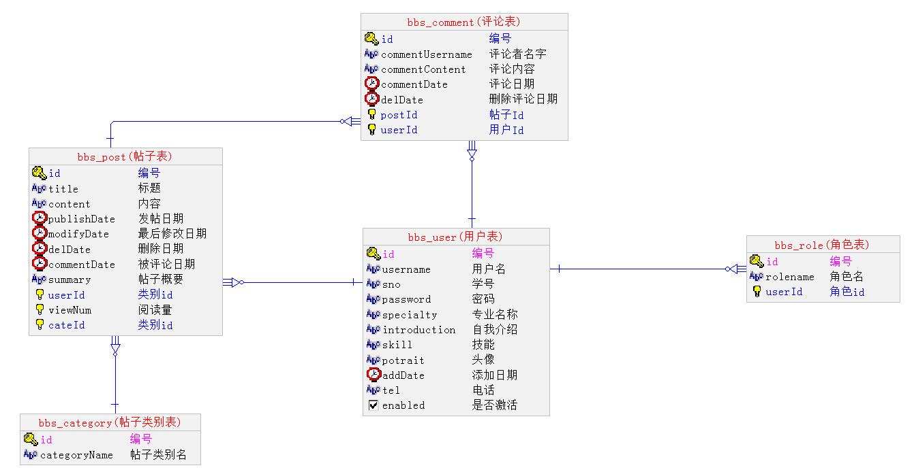

# bbs
## 角色分类： 
普通用户，版主，系统管理员 

## 各种角色的操作： 
1.普通用户 
登录，注销，浏览帖子，发帖，在帖子底下评论，管理个人信息 

2.版主 
登录，注销，浏览帖子，发帖，在帖子底下评论，删除帖子，修改帖子，设置精华帖，置顶帖子，删除评论，管理个人信息，对普通用户进行禁言操作，单独管理某个模块，查询普通用户的个人信息 

3.系统管理员 
登录，注销，浏览帖子，发帖，在帖子底下评论，删除帖子，设置精华帖，置顶帖子，删除评论，管理个人信息，对普通用户进行禁言操作，单独管理某个模块，查询普通用户的个人信息， 根据如excel导入学生个人信息（学号，姓名，初始密码） 

## 数据库的设计： 
1.用户表（bbs_user） 
2.角色表（bbs_roles） 
3.帖子表（bbs_post） 
4.帖子分类表（bbs_category） 
5.评论表（bbs_comment） 

# 2019.6.26
## 管理员特有操作： 
### 一、对用户的操作 
1.根据姓名查询学生所有信息（包括角色信息） 
2.删除、修改、导入学生信息 
3.对学生进行禁言操作（暂时未找到对应的解决办法，待续）
### 二、对帖子的操作 
1.查看所有帖子的信息 
2.删除帖子 
### 三、对帖子类别的操作 
1.查看所有帖子类别信息 
2.删除帖子类别 
### 四、对评论的操作 
1.根据板块查看所有评论信息，或直接查看所有评论信息 
2.删除评论信息 
